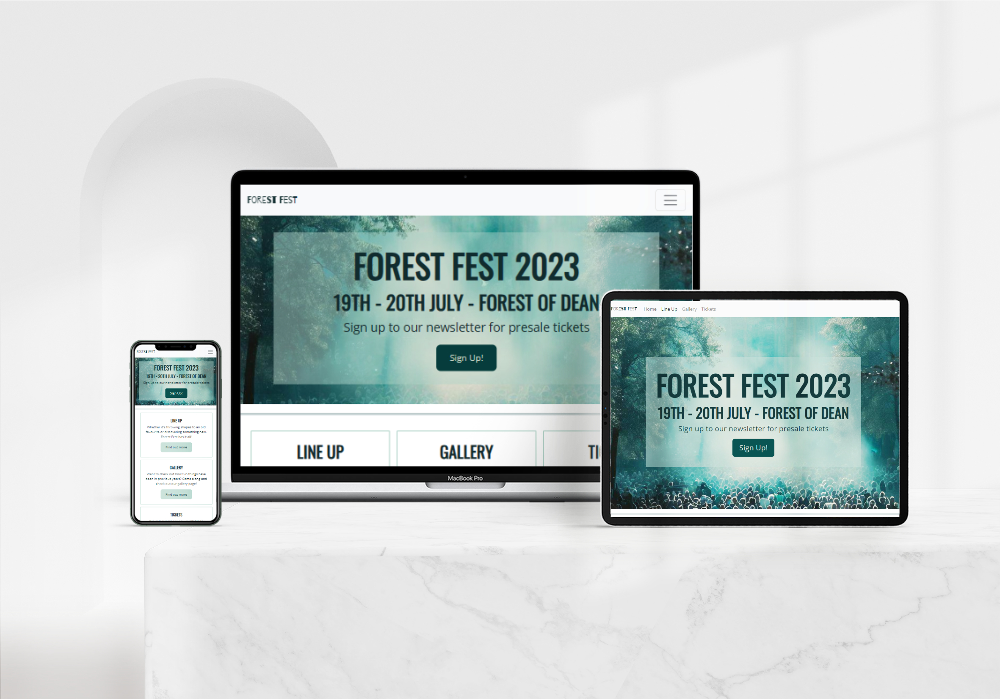
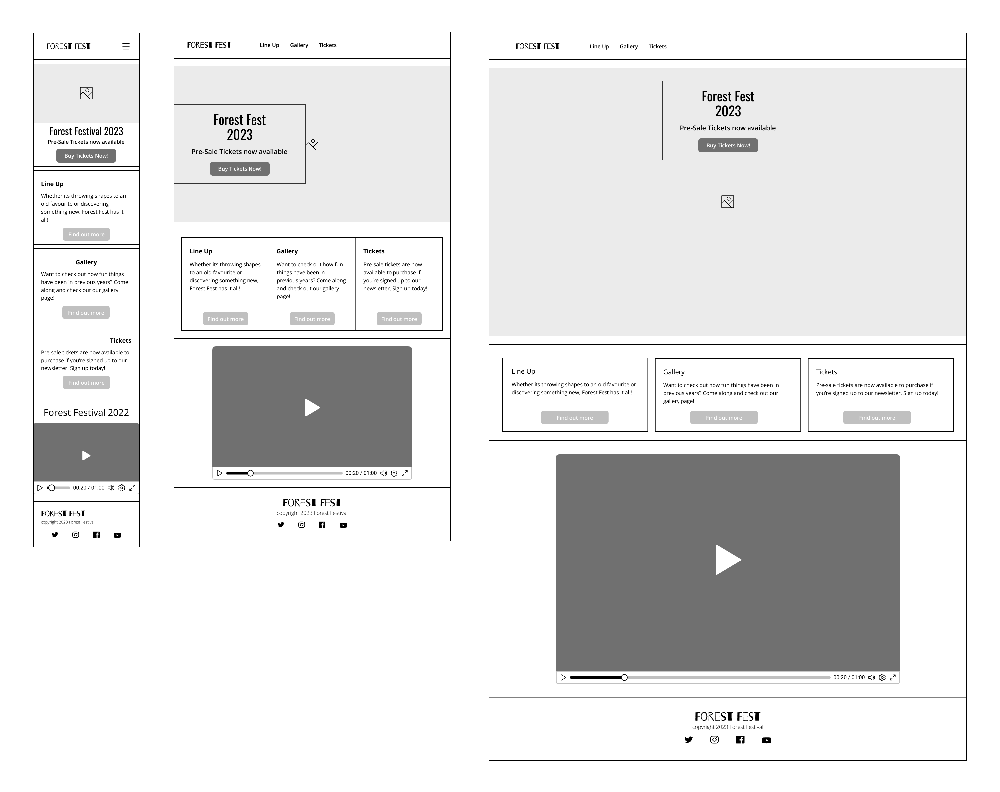
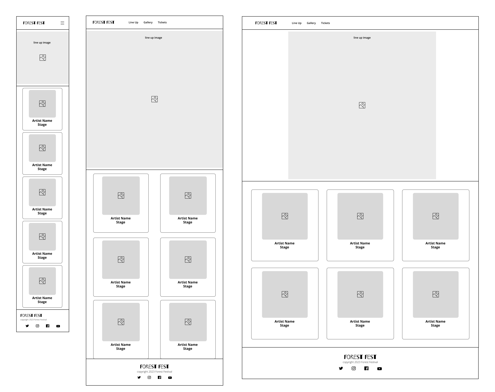
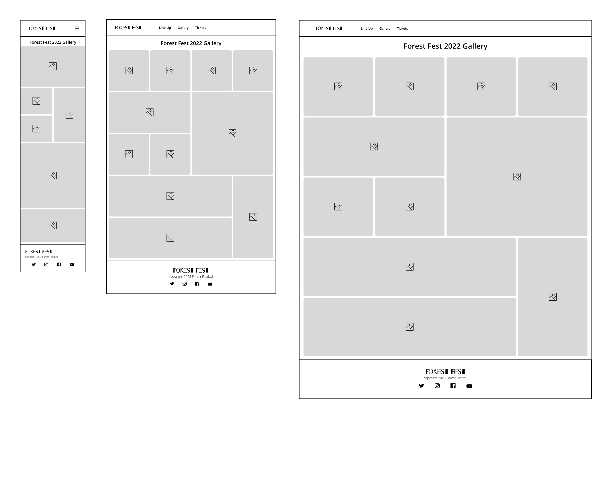
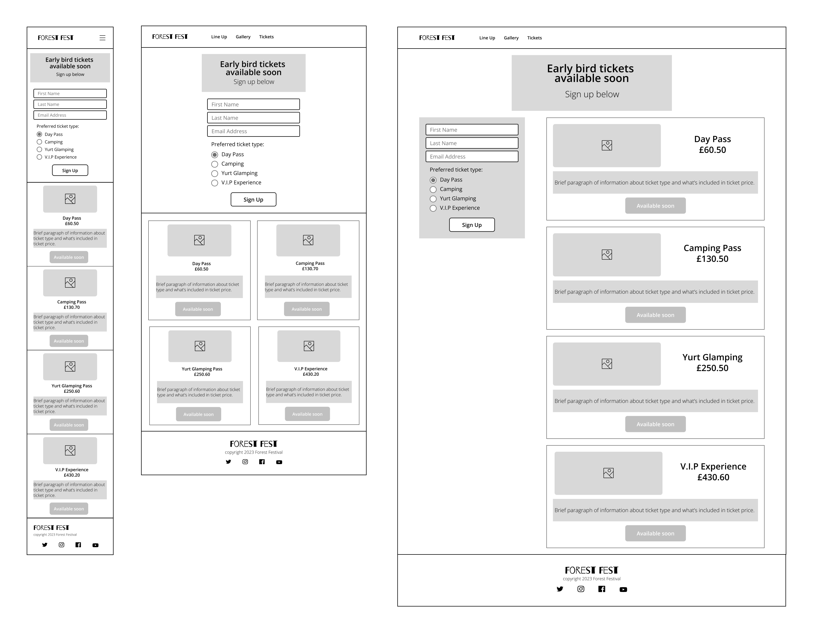

# Forest Festival
[Link to website](https://lrchnnng.github.io/forestfest/)

## Table of contents
[Table of contents](#table-of-contents)
* [Website Information](#website-information)
  - [Website purpose](#website-purpose)
  - [Website Sections:](#website-sections)
* [UX](#ux)
  - [Strategy](#strategy)
  - [Scope](#scope)
  - [Structure](#structure)
  - [Skeleton](#skeleton)
  - [Surface](#surface)
* [Features](#features)
* [Technologies Used](#technologies-used)
* [Testing](#testing)
* [Deployment](#deployment)
* [Credits](#credits)
* [Acknowledgments](#acknowledgments)

## Website Information
Business goals: 
* To sell tickets to the user
* To show the user images of previous years
* To promote featured artists for the event
* Encourage the user to sign up to the newsletter

### Website Sections:
1. Home/Landing Page
2. Line Up - A short introduction to some featured artists
3. Gallery - A gallery page for images of the festival from prior years
4. Tickets - A page to sign up to newsletter for early access to tickets

---

## UX 
Whilst designing and creating this website I have taken into account the five planes of UX design, strategy, scope, structure, skeleton and surface.

### Strategy
I began by creating the foundation for my website, I defined my target user and the types of features and technologies. 

Target users for Forest Fest:
* Ages 25-40
* Festival and nature lovers
* People who are intersted in music and comedy
* People looking for information about Forest Fest

First time and returning user goals: 
* Easily find the price of the tickets
* Clearly see the dates of the event
* View the line up of the event
* Sign up to the newsletter
* Navigate to social media pages for more information and images

### Scope
The second plane of UX looks at the **scope** of the website. What does the user have to do in order to reach the goals for the website. Do they need to search? Do they need to sign up to a newsletter?

### Structure
Flow of website, a site map, description of interaction

### Skeleton
The **skeleton** plane of UX design is a more visual representation of the flow in which a user might use the website. Using wireframes to show a basic design layout 
removes colour, Typography, imagery to create a basic view of website and layout

### Surface
Typography, colours, photography, language 
Interface with which user interacts, buttons
---

## Features
**Line up Images**
  * I had originally added a grayscale filter to artist info cards which would be removed when you hover over each individual card colourising the image. I have since removed it on the mobile  and tablet size as the hover feature does not work with mobile and tablet devices. 
---

## Technologies Used
- [Lighthouse Accessibility Tools](https://developer.chrome.com/docs/lighthouse/overview/)
- [W3C HTML Validator](https://validator.w3.org/)
- [W3C CSS Validator](https://jigsaw.w3.org/css-validator/)
---

## Testing
---
- **User Stories**
- **Lighthouse**
- **HTML and CSS Validation**
- **Known bugs and fixes**
  * Struggled to get social media icons to show from [Font Awesome](https://fontawesome.com/v4/icons/). Re linked the stylesheet using the link from Code Institute, Love Running Project and the icons have appeared.
  * When creating responsive artist info cards on tickets.html I found that one side of the grid increased in height while the other side stayed the same. Fixed by specifying width in percentages rather than relying on auto.
  * I had used button elements with inherited anchor elements in order to link to separate pages, this did not pass the [HTML validator](https://validator.w3.org/nu/) so I removed button elements and styled the remaining anchor elements to appear as buttons.

## Deployment
---

## Credits
- Google Fonts - Barrio and Open Sans

---

## Acknowledgments
- [mdn web docs](https://developer.mozilla.org/en-US/docs/Web/CSS/filter) for the grayscale image filter
---
