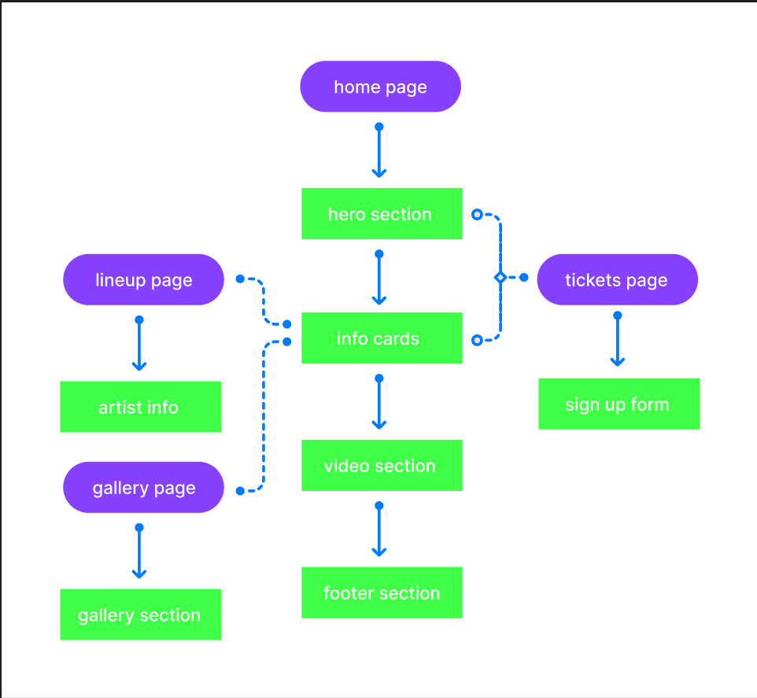
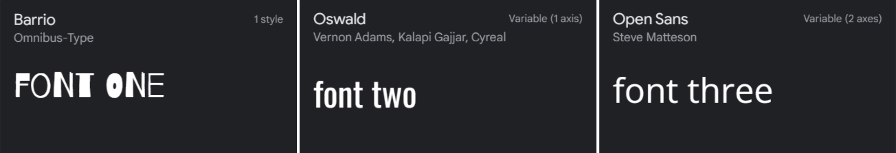
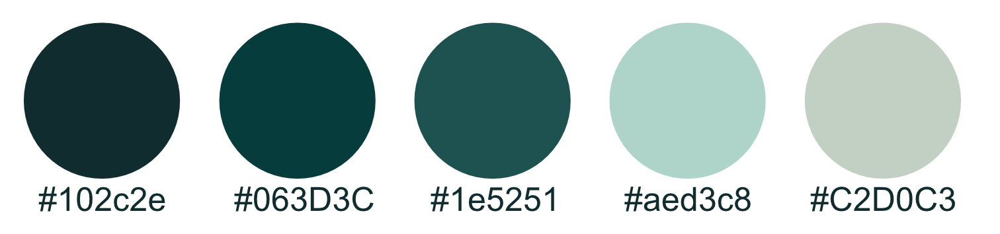
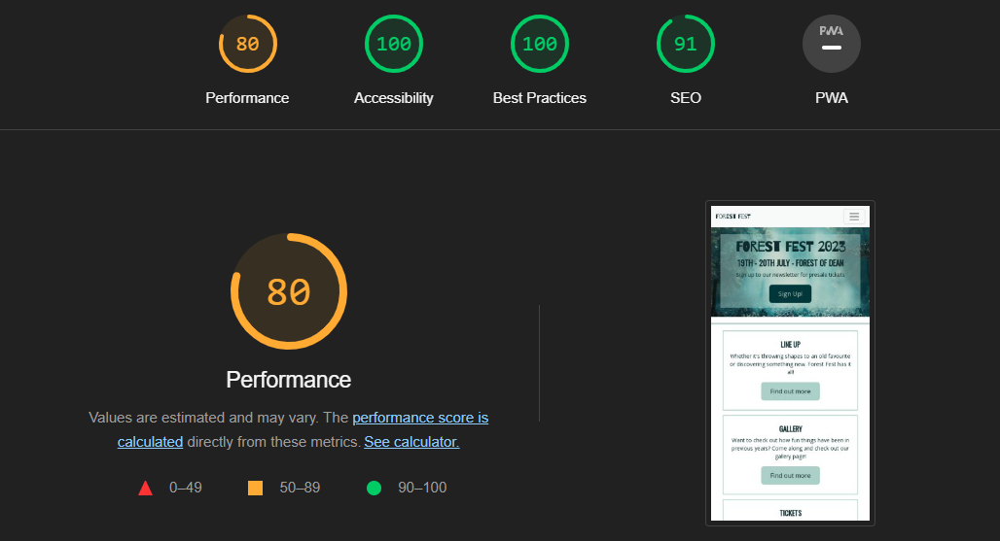
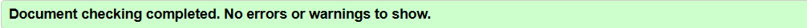

# Forest Festival
[Link to website](https://lrchnnng.github.io/forestfest/)

## Table of contents
[Table of contents](#table-of-contents)
* [Website Information](#website-information)
  - [Website purpose](#website-purpose)
  - [Website Sections:](#website-sections)
* [UX](#ux)
  - [Strategy](#strategy)
  - [Scope](#scope)
  - [Structure](#structure)
  - [Skeleton](#skeleton)
  - [Surface](#surface)
* [Features](#features)
* [Technologies Used](#technologies-used)
* [Testing](#testing)
* [Deployment](#deployment)
* [Credits and Acknowledgments](#credits-and-acknowledgements)

## Website Information
Business goals: 
* To sell tickets to the user
* To show the user images of previous years
* To promote featured artists for the event
* Encourage the user to sign up to the newsletter

### Website Sections:
1. Home/Landing Page
2. Line Up - A short introduction to some featured artists
3. Gallery - A gallery page for images of the festival from prior years
4. Tickets - A page to sign up to newsletter for early access to tickets

---

## UX 
Whilst designing and creating this website I have taken into account the five planes of UX design, strategy, scope, structure, skeleton and surface.

### Strategy
I began by creating the foundation for my website, I defined my target user and the types of features and technologies. 

Target users for Forest Fest:
* Ages 25-40
* Festival and nature lovers
* People who are intersted in music and comedy
* People looking for information about Forest Fest

First time and returning user goals: 
* Easily find the price of the tickets
* Clearly see the dates of the event
* View the line up of the event
* Sign up to the newsletter
* Navigate to social media pages for more information and images

Another goal for my website was to create an intuitive experience making the page easy to navigate without the user having to think too much about their next move. With the understanding that my user demographic is most likely viewing the website across a variety of devices, I have made sure that the site is fully responsive across screen sizes in order to optimize user experience.

### Scope
The second plane of UX looks at the **scope** of the website. What does the user have to do in order to reach the goals for the website. Do they need to search? Do they need to sign up to a newsletter? The important part of this phase is looking at what specific features I will include in order to meet both user and business goals.

#### Features

Homepage:
* An easy to use navigation bar directing to other pages on the website
* A hero section with a brief section of information about Forest Fest and a direct link to sign up for the newsletter
* Information cards on the homepage with a brief description and a direct link to their respective pages
* A video section including footage from the festival from a previous year
* A footer section with copyright information and external links to Forest Fest social media accounts

Line Up Page:
* A header to identify the current page
* A selection of artist information card including a photo, the artist name (including an external link to the artists personal webpage) and the name of the stage they will be performing on

Gallery Page:
* A header to identify the current page
* A gallery of images from previous years at Forest Festival

Tickets Page:
* A header to identify the current page
* A sign up form for the presale tickets and newsletter inclding the option to select specific ticket types

### Structure
I created a userflow diagram to show how the user will interact with each page on the site.

### Skeleton
The **skeleton** plane of UX design is a more visual representation of the flow in which a user might use the website. Using wireframes to show a basic design layout 
removes colour, Typography, imagery to create a basic view of website and layout

### Surface
#### Typography
I opted to use 3 fonts from [Google Fonts](https://fonts.google.com/), a Logo font, a header font and a main text font.

#### Colours
I created a limited colour palette taking inspiration from the hero image and nature. I also opted to use colour variables within my CSS code so as to make the colours more consistent throughout.

#### Photography
I used a combination of AI images using [Bing Image Creator](https://www.bing.com/images/create?FORM=GENILP) and images from other forest related festivals from google images.

---

## Features
**Line up Images**
  * I had originally added a grayscale filter to artist info cards which would be removed when you hover over each individual card colourising the image. I have since removed it on the mobile  and tablet size as the hover feature does not work with mobile and tablet devices. 
---

## Technologies Used
- [HTML](https://developer.mozilla.org/en-US/docs/Web/HTML)
  * Used to create the basic structure and meaning of the webpage
- [CSS](https://developer.mozilla.org/en-US/docs/Learn/Getting_started_with_the_web/CSS_basics)
  * Used to style the content within the webpage
- [Bootstrap](https://getbootstrap.com/)
  * Bootstrap was used to create a fully responsive navbar
- [JavaScript](https://www.javascript.com/)
  * Used with Bootstrap in order to create a responsive drop down nav bar on mobile and tablet devices
- [Google Fonts](https://fonts.google.com/)
  * Used to add in specific fonts to the webpage
- [W3C HTML Validator](https://validator.w3.org/)
  * Used to make sure there are no errors within my HTML code and to make sure it adheres to standard coding practices
- [W3C CSS Validator](https://jigsaw.w3.org/css-validator/)
  * Used to make sure there are no errors within my CSS code and to make sure it adheres to standard coding practices
- [Lighthouse Accessibility Tools](https://developer.chrome.com/docs/lighthouse/overview/)
  * Used to make sure that the webpage adheres to industry standard accessibility standards
- [mdn web docs](https://developer.mozilla.org/en-US/docs/Web/CSS/filter) 
  * For the grayscale image filter
- [VS Code](https://code.visualstudio.com/)
  * A code editor used to write, store and push code to Git and Github
- [Github](https://github.com/)
  * Used to store the code for my project once pushed from VS Code
- [Git](https://git-scm.com/)
  * Used for version control when connected to both Github and VS Code
---

## Testing
- **Lighthouse**
  
  * I had originally placed a video on my index page which brought my performance score down to around 36%. Unfortunately, as I do not yet have the knowledge to remove all the unused javascript causing this low performance score I opted to switch out the video for an interactive map from Google showing the location of the festival.
  * I had a fairly low score for performance on both line up page and gallery page which I fixed by reducing the image sizes.
- **HTML and CSS Validation**
  * HTML
    
  * CSS
    
- **Known bugs and fixes**
  * Struggled to get social media icons to show from [Font Awesome](https://fontawesome.com/v4/icons/). Re linked the stylesheet using the link from Code Institute, Love Running Project and the icons have appeared.
  * When creating responsive artist info cards on tickets.html I found that one side of the grid increased in height while the other side stayed the same. Fixed by specifying width in percentages rather than relying on auto.
  * I had used button elements with inherited anchor elements in order to link to separate pages, this did not pass the [HTML validator](https://validator.w3.org/nu/) so I removed button elements and styled the remaining anchor elements to appear as buttons.
  * The most errors I encountered were using 'section' elements without a heading element instead of 'div', I fixed this across the webpage and encountered no further errors.

## Deployment
GitHub pages deployment
*Log in to GitHub*
In your Repository section, select the project repository that you want to deploy
In the menu located at the top of this section, click 'Settings'
Select 'Pages' on the left-hand menu - this is around halfway down
In the source section, select branch 'Master' and save
The page is then given a site URL which you will see above the source section

Once this is complete you should be able to view the webpage online, this is updated every so often which allows the user to see any changes in almost real time.
---

## Credits and Acknowledgments
- [Google Fonts](https://fonts.google.com/)
- [Bing Image Creator](https://www.bing.com/images/create?FORM=GENILP)
- [W3Schools](https://www.w3schools.com/)
- [mdn web docs](https://developer.mozilla.org/en-US/docs/Web/CSS/filter)
- [Lighthouse](https://developer.chrome.com/docs/lighthouse/overview/)
- [Google Images](https://images.google.co.uk/)
- [Bootstrap](https://getbootstrap.com/)
- [Github](https://github.com/)
- [VS Code](https://code.visualstudio.com/)
- [Code Institute](https://codeinstitute.net/full-stack-software-development-diploma/?hsa_acc=8983321581&hsa_cam=1578649861&hsa_grp=1147890658588794&hsa_ad&hsa_src=o&hsa_tgt=kwd-71743597220113%3Aloc-188&hsa_kw=code%20institute&hsa_mt=e&hsa_net=adwords&hsa_ver=3&msclkid=cb5b5e178d031bfb76043ac0f09bb7a2&utm_source=bing&utm_medium=cpc&utm_campaign=CI%20-%20UK%20-%20Search%20-%20Brand&utm_term=code%20institute&utm_content=CI%20-%20UK%20-%20Search%20-%20Brand%20-%20Exact)
---
