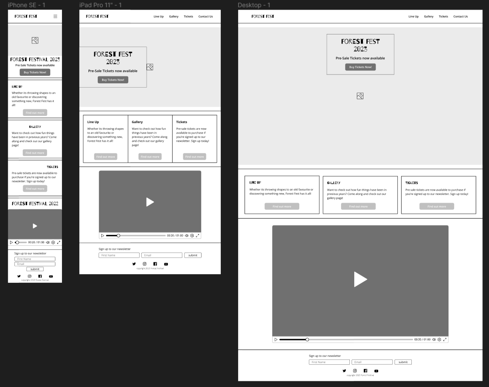

# Forest Festival
[Link to website](https://lrchnnng.github.io/forestfest/)

**Website purpose**

**Website Sections:**
1. Home/Landing Page
2. Line Up - A short introduction to some featured artists
3. Gallery - A gallery page for images of the festival from prior years
4. Tickets - A page to sign up to newsletter for early access to tickets

**Business goals**
1. To sell tickets to the user
2. To show the user images of previous years
3. To promote featured artists for the event
4. Encourage the user to sign up to the newsletter

**First Time and Recurring User goals**
1. Easily find the price of the tickets
2. Clearly see the dates of the event
3. View the line up of the event
4. Sign up to the newsletter
5. Navigate to social media pages for more information and images

---

## UX

### Strategy

### Scope

### Structure

### Skeleton

### Surface
---

## Features
---

## Technologies Used
---

## Testing
---
- **User Stories**
- **Lighthouse**
- **HTML and CSS Validation**
- **Known bugs and fixes**
    1. Struggled to get social media icons to show from [Font Awesome](https://fontawesome.com/v4/icons/). Re linked the stylesheet using the link from Code Institute, Love Running Project and the icons have appeared.
    2. When creating responsive artist info cards on tickets.html I found that one side of the grid increased in height while the other side stayed the same. Fixed by specifying width in percentages rather than relying on auto.

## Deployment
---

## Credits
- Google Fonts - Barrio and Open Sans

---

## Acknowledgments
---
